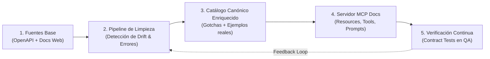

# Plan de Implementación: Servidor MCP Hermano de Documentación (`contabilium-docs-mcp`)

## 1. Contexto y Objetivos

### El Problema
En el soporte y desarrollo del ecosistema Contabilium, se registran aproximadamente **40 tickets semestrales de desarrolladores y partners** con consultas recurrentes:
* "¿Qué endpoint debo usar para consultar el stock disponible?"
* "¿Cómo se estructura el payload para emitir una Factura A con percepciones?"
* "¿Por qué el filtro `tipo` o `fecha` en `/comprobantes/search` no responde como indica la doc pública?"
* "¿Cuáles son las diferencias de autenticación o campos requeridos entre Argentina, Chile y Uruguay?"

### La Solución Arquitectural
Separar las responsabilidades en dos servidores MCP independientes:
1. **`contabilium-mcp` (Servidor Operacional / Gateway):** Conectado con credenciales activas del cliente para consultar datos en vivo (dashboards, stock, deuda) y diagnóstico de órdenes (OP-8).
2. **`contabilium-docs-mcp` (Servidor de Conocimiento / Documentación):** Servidor estático/asistente sin credenciales de negocio, especializado en la especificación de la API, esquemas, flujos de integración y "gotchas" técnicos.

> [!IMPORTANT]
> **El gran desafío de este proyecto:** La documentación pública y base de las APIs suele tener *drift* (desactualizaciones, campos requeridos que son opcionales, parámetros que el backend ignora, respuestas no modeladas). Por ello, el proyecto no es un mero "lector de swagger", sino un **proceso de saneamiento, curaduría y testing continuo**.

---

## 2. Fases de Implementación y Proceso de Limpieza Continua



### Fase 1: Extracción y Consolidación de la Documentación Base
* **Entradas:**
  * Archivo Swagger/OpenAPI (`swagger.json` / `openapi.yaml`) provisto por backend.
  * Portal público de desarrolladores (`developers.contabilium.com` o similar).
  * Colección histórica de Postman del equipo de integraciones.
* **Salida:** Archivo normalizado `raw-api-specs.json` que consolide todos los endpoints, métodos, parámetros y respuestas declaradas.

### Fase 2: Limpieza Heurística y Depuración de Discrepancias
Se ejecuta un proceso de revisión y saneamiento para resolver los siguientes defectos típicos:
1. **Endpoints Fantasmas o Deprecados:** Marcar con `deprecated: true` o descartar endpoints que ya no tienen soporte en v2/v3.
2. **Parámetros Ignorados por la API:** Documentar explícitamente parámetros que figuran en la doc pública pero que el backend ignora (ej. el filtro `tipo` en `/comprobantes/search` que requiere filtrado en memoria).
3. **Tipos de Datos Inexactos:** Corregir campos declarados como `integer` que la API devuelve como `string` o importes flotantes con coma en lugar de punto.
4. **Respuestas de Error Reales:** Documentar códigos HTTP reales (401, 403 por Cloudflare, 429 por rate limit de 2 req/s) y payloads de error (`Description` vs `Message`).

### Fase 3: Enriquecimiento con "Gotchas" y Flujos de Integración
Por cada endpoint y módulo crítico, agregar metadatos humanos no presentes en un Swagger básico:
* **Límites operativos:** Tope de páginas (20 páginas / 1.000 registros), ventanas de tiempo (máx. 92 días para comprobantes).
* **Guías por País:**
  * **Argentina (AR):** Facturas A/B/C, notas de crédito/débito, validaciones AFIP, tipos de IVA y CUIT.
  * **Chile (CL):** Boletas y facturas electrónicas, RUT, validaciones SII.
  * **Uruguay (UY):** CFE, e-Factura, e-Ticket, RUT/CI, validaciones DGI.
* **Recetas de Integración (Playbooks):**
  * Flujo de sincronización de catálogo y stock para E-commerce (Fenicio, WooCommerce, VTEX, Shopify).
  * Flujo de facturación automática post-pago (webhook de checkout -> alta de cliente -> emisión de comprobante).

### Fase 4: Construcción del Servidor MCP (`contabilium-docs-mcp`)
Desarrollo del servidor MCP con `@modelcontextprotocol/sdk` exponiendo tres primitivas fundamentales:

#### A. Recursos MCP (`Resources`)
Lectura directa de especificaciones estáticas para el contexto del LLM:
* `resource://docs/overview`: Visión general, autenticación, rate limits y convenciones globales.
* `resource://docs/modules/{modulo}`: Endpoints agrupados por módulo (`comprobantes`, `conceptos`, `clientes`, `proveedores`, `inventarios`, `integraciones`).
* `resource://docs/schemas/{entidad}`: Esquemas de datos detallados (`Comprobante`, `Producto`, `Cliente`).
* `resource://docs/gotchas`: Lista curada de trampas frecuentes y diferencias entre la doc teórica y el comportamiento real.

#### B. Herramientas MCP (`Tools`)
Búsqueda y asistencia activa para desarrolladores:
* `buscar_documentacion_api({ query, modulo, pais })`: Búsqueda léxica o semántica sobre todos los endpoints y guías.
* `obtener_detalle_endpoint({ ruta, metodo })`: Retorna parámetros exactos, encabezados, payload de ejemplo y advertencias conocidas.
* `validar_payload_estatico({ endpoint, metodo, payload })`: Valida sintácticamente un JSON contra el esquema canónico sin necesidad de enviar la petición a producción, señalando campos faltantes o tipos incorrectos.
* `recomendar_flujo_integracion({ caso_uso, plataforma_origen })`: Devuelve el diagrama de secuencia y lista ordenada de llamadas para resolver un caso de negocio.

#### C. Prompts MCP (`Prompts`)
Plantillas interactivas prediseñadas:
* `como_integrar_tienda_online`: Guía interactiva paso a paso para sincronizar catálogo, stock y facturación.
* `depurar_error_api`: Asistente para diagnosticar un código HTTP (400, 401, 403, 429, 500) y mensaje recibido.
* `guia_fiscal_por_pais`: Explicación de campos fiscales obligatorios según AR, CL o UY.

### Fase 5: Pipeline Continuo de Validación contra Sandbox
Para evitar que la documentación vuelva a quedar obsoleta:
* Implementar un suite de **Contract Testing** automatizado (Jest o Node Test Runner) que ejecute llamadas de prueba contra el ambiente de QA (`https://restapiqa.contabilium.com`).
* Si un endpoint cambia su formato de respuesta o rechaza un payload documentado, una alarma de CI/CD marca el esquema para revisión.

---

## 3. Estructura de Directorios Recomendada para `contabilium-docs-mcp`

```
contabilium-docs-mcp/
├── .github/
│   └── workflows/
│       └── contract-tests.yml        # Validación continua de esquemas contra QA
├── data/
│   ├── raw/                         # Swagger original y scrapes crudos
│   │   ├── swagger-v1.json
│   │   └── scraped-portal-docs.json
│   ├── curated/                     # Documentación curada, limpia y saneada
│   │   ├── endpoints/
│   │   │   ├── comprobantes.json
│   │   │   ├── conceptos.json
│   │   │   ├── clientes.json
│   │   │   ├── inventarios.json
│   │   │   └── proveedores.json
│   │   ├── schemas/
│   │   │   ├── comprobante.schema.json
│   │   │   └── concepto.schema.json
│   │   ├── gotchas.json             # Excepciones y bugs documentados
│   │   └── integration-guides/
│   │       ├── ecommerce-sync.md
│   │       └── billing-flow.md
├── scripts/
│   ├── ingest-swagger.js            # Script para actualizar desde Swagger
│   ├── validate-drift.js            # Comparador de diferencias raw vs curated
│   └── test-contracts.js            # Runner de pruebas contra sandbox
├── src/
│   ├── index.js                     # Servidor MCP stdio / sse
│   ├── resources.js                 # Registro de MCP Resources
│   ├── tools.js                     # Registro de Tools (buscar, validar payload)
│   ├── prompts.js                   # Registro de MCP Prompts
│   └── search-engine.js             # Motor de búsqueda indexada en memoria
├── package.json
└── README.md
```

---

## 4. Plan de Acción y Siguientes Pasos

1. **Sprint 0 (1 semana):**
   * Crear el repositorio `contabilium-docs-mcp`.
   * Exportar el Swagger/OpenAPI oficial actual y colecciones Postman existentes en `data/raw/`.
2. **Sprint 1 (2 semanas):**
   * Limpieza de los 3 módulos con mayor volumen de tickets: **Comprobantes**, **Conceptos/Stock** y **Clientes**.
   * Redacción de la sección de `gotchas` (rate limits, paginación, filtros no soportados).
3. **Sprint 2 (1 semana):**
   * Implementación de herramientas `buscar_documentacion_api`, `obtener_detalle_endpoint` y `validar_payload_estatico`.
   * Pruebas internas con los desarrolladores del equipo.
4. **Sprint 3 (1 semana):**
   * Publicación para partners de integración (Fenicio, Base, etc.) y documentación en el portal de desarrolladores.
