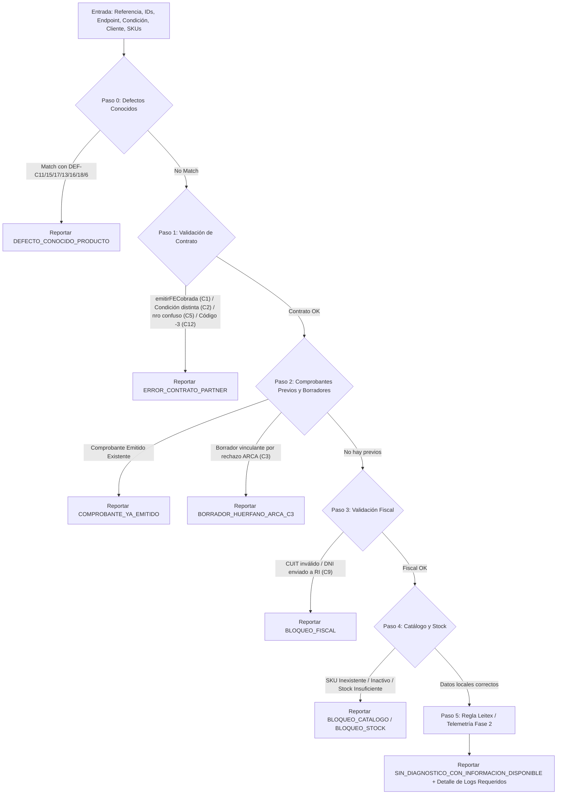

# OP-08: Diagnóstico Forense de Órdenes e Integraciones de E-Commerce (v2)

**Estado:** FINALIZADO  
**Fecha:** 30/09/2026 (Auditado y Re-arquitecturado según casos de soporte)  
**Severidad:** ALTA / OPERACIONES  
**Módulo:** `src/tools/diagnosticar_orden.js`  
**Referencia:** Auditoría de 18 casos reales de soporte a partners (Hezka, Base, Pirout, Luna, Leitex, Fenicio, Atrix, VCP, Producteca, MercadoLibre).

---

## 1. Contexto y Hallazgos de la Auditoría

La auditoría de tickets reales reveló que soporte resolvía los casos mediante cuatro pasos repetitivos (ubicar orden multicanal, verificar estado/comprobante/borrador, revisar logs y contrastar datos fiscales).

Se identificaron tres principios arquitecturales que transformaron la herramienta:
1. **Un mismo error tapa varias causas:** El mensaje genérico *"La orden de venta es inexistente"* se producía por 4 causas distintas:
   * Intento previo rechazado por ARCA que dejó un borrador vinculado y sacó la orden de cola (C3).
   * Parámetro `nro` enviado con ID interno en vez de `IDVentaIntegracion` (C5).
   * `idIntegracion` equivocado entre múltiples integraciones de la cuenta (C7).
   * Concurrencia o catch silencioso en backend de Contabilium (C4, C6).
2. **Registro de Defectos Conocidos (Known Product Issues):** El algoritmo no debe culpar al partner de comportamientos derivados de bugs o limitaciones conocidas de Contabilium:
   * **DEF-C11 (API-1278):** Alta automática de clientes con CUIT les asigna "Consumidor Final" por defecto.
   * **DEF-C15 (API-1256):** `StockConReservas` trunca en 0 ante sobreventas en vez de devolver saldo negativo.
   * **DEF-C17 (API-1151):** NC automáticas de MercadoLibre en borrador por correlatividad temporal de fecha en ARCA.
   * **DEF-C13 (API-1206/1261):** Notificaciones no enviadas previo al 25/8 por caída del microservicio.
   * **DEF-C16 (API-1239):** Canal vacío por arquitectura de ID unificado en Producteca.
   * **DEF-C18 (API-1123):** Timeout 504 por sincronizaciones en lotes masivos (>500 ítems).
   * **DEF-C6 (API-1145):** Error 500 no capturado en Grafana por bloque catch no instrumentado.
3. **Regla de Oro de Evidencia Estricta (Principio Leitex / C14) & Manejo de Fase 2:**
   * **Nunca concluir "problema del partner" sin evidencia.**
   * Si con los datos disponibles en Contabilium no se detectan errores locales, la tool responde explícitamente `SIN_DIAGNOSTICO_CON_INFORMACION_DISPONIBLE`, aclarando a soporte que no se detectaron fallas locales y listando con precisión la telemetría de infraestructura (Fase 2) necesaria para concluir (logs de nginx `access_rest.contabilium.log`, callbacks salientes, payload crudo).

---

## 2. Árbol de Diagnóstico Heurístico en Cascada

---

## 3. Verificación Automatizada (`tests/phase1.test.js`)

Se ejecutan 33 tests con 100 % de éxito cubriendo:
* **C1:** Detección de `comprobantes/emitirFECobrada` en vez de `ordenesventa/emitirFE`.
* **C2:** Discrepancia tipográfica en Condición de Venta (`Mercado Pago` vs `MercadoPago`).
* **C3:** Desambiguación de orden inexistente por borrador huérfano vinculado.
* **C5:** Confusión de parámetro `nro` con ID secuencial interno.
* **C11:** Reconocimiento de defecto conocido en alta de clientes con CUIT.
* **Fase 2:** Respuesta explícita de ausencia de diagnóstico concluyente local sin culpar al partner + lista de telemetría de nginx faltante.
* Comprobantes previos, validación fiscal Módulo 11, catálogo de SKUs y quiebre de stock.
