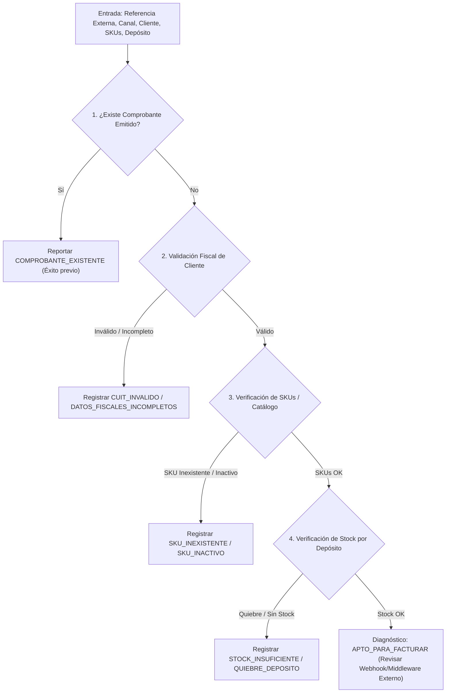

# OP-08: Diagnóstico de Órdenes e Integraciones de E-Commerce

**Estado:** FINALIZADO  
**Fecha:** 30/09/2026  
**Severidad:** ALTA / OPERACIONES  
**Módulo:** `src/tools/diagnosticar_orden.js`  
**Referencia:** Tickets de integraciones de Base, Vestetic, Fenicio y Luna (~30 tickets semestrales de alto tiempo de resolución).

---

## 1. Contexto y Problema

Los tickets de soporte originados por partners de integración e-commerce (Fenicio, Base, Vestetic, Luna) son los que mayor consumo de horas generan en el equipo de Contabilium. El síntoma recurrente es: *"La orden X del e-commerce no se facturó / no impactó el stock / tiró error genérico"*.

Hoy el equipo de soporte debe realizar manualmente 4 o 5 consultas desconectadas para diagnosticar el problema:
1. Buscar si el comprobante ya se emitió o quedó duplicado.
2. Chequear si el cliente tiene CUIT/DNI válido y condición fiscal correcta ante AFIP/SII/DGI.
3. Chequear si los SKUs de los ítems existen y están activos en el catálogo de Contabilium.
4. Chequear si el depósito de la integración cuenta con stock físico y disponible suficiente, o si hay un quiebre de stock que bloquea la venta.

---

## 2. Solución Implementada

Se implementó la tool `diagnosticar_orden` que ejecuta un **árbol de diagnóstico heurístico en cascada**:

### Heurísticas y Reglas de Diagnóstico:
1. **Detección de Duplicados / Emisión Previa:**
   * Si la orden ya generó una factura o remito en el período, retorna los datos del comprobante para evitar dobles emisiones.
2. **Validación Fiscal:**
   * Valida algoritmo Módulo 11 para CUITs en Argentina (AR), longitud y formato para RUT en Chile (CL) o Uruguay (UY).
   * Alerta si el tipo de comprobante esperado requiere CUIT pero el cliente viene como Consumidor Final sin documento.
3. **Validación de Catálogo (SKUs):**
   * Busca cada código SKU provisto. Si no existe, indica exactamente qué código debe darse de alta.
   * Si el ítem está inactivo en Contabilium, advierte que la API rechazará la venta.
4. **Verificación de Stock Físico y Disponible:**
   * Compara `cantidad_solicitada` contra `stock_disponible = stock_actual - stock_reservado` en el depósito especificado.
   * Si hay sobreventa o stock cero, detalla el faltante exacto por ítem.
5. **Veredicto y Próximos Pasos (Next Actions):**
   * Retorna `estado` (`EXITO_PREVIO`, `BLOQUEANTE_DETECTADO`, `ADVERTENCIA`, `APTO_PARA_FACTURAR`).
   * Provee una lista de `acciones_recomendadas` directas para que el agente de soporte o el partner solucione el problema en menos de 1 minuto.

---

## 3. Verificación Automatizada

Se implementaron pruebas unitarias cubriendo:
* Detección de comprobante ya emitido (previene doble facturación).
* Detección de SKU inexistente e inactivo.
* Detección de quiebre de stock en depósito asignado.
* Validación de CUIT inválido con algoritmo de verificación fiscal.
* Orden limpia sin errores locales (señala que el fallo está en el webhook/middleware del partner).
